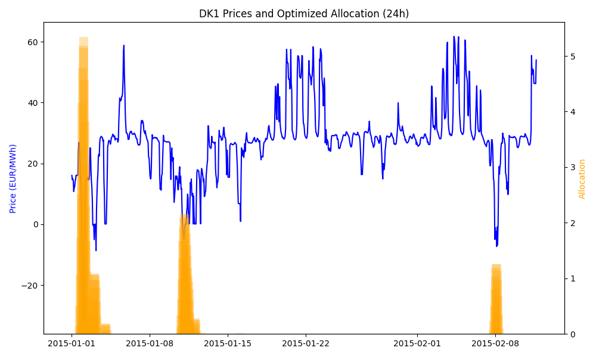

# power-opsd-dk1

Demo project: ingest hourly Danish electricity prices (DK1) from OPSD, store in TimescaleDB, run quadratic optimization, and plot results. Everything runs in Docker.



## Quickstart

```bash
git clone https://github.com/8vasu/power-opsd-dk1
cd power-opsd-dk1
cp env.example .env
make build
make run
```

Optional:

```bash
make down
```

or

```bash
make clean
```

Please check the `Makefile` for the exact commands associated with these targets.
